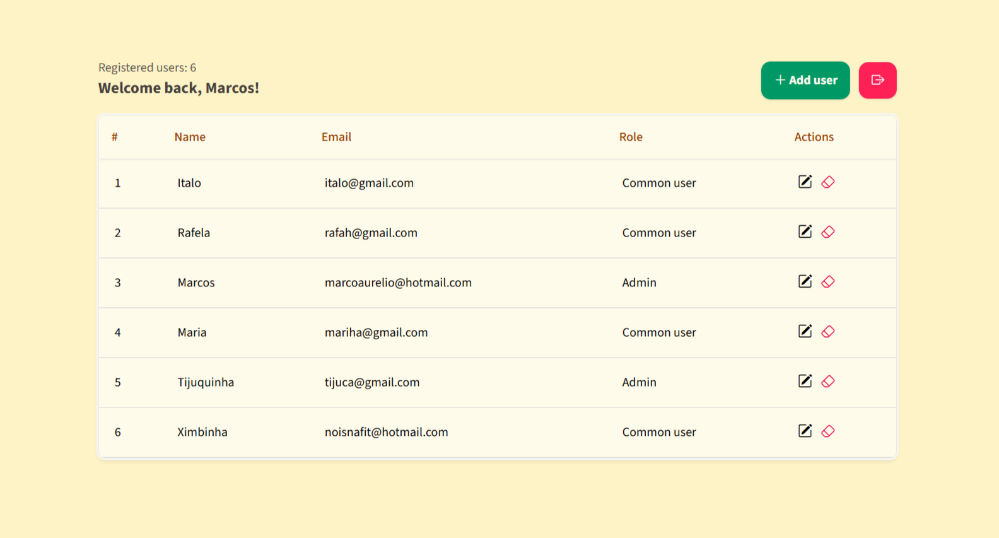

# ☕ Java no Frontend



[](https://www.oracle.com/java/technologies/downloads/)


Mini projeto de CRUD (Create, Read, Update, Delete) com conexão ao banco de dados MySQL e Jakarta.

## 🚀 Como rodar o projeto

1. **Pré-requisitos:**
   - [Java 21](https://adoptopenjdk.net/)
   - [MySQL](https://www.mysql.com/)
   - [Tomcat 11.0.6](https://tomcat.apache.org/)

2. **Clone o projeto**
   ```bash
   git clone https://github.com/ItaloBrazucaDeveloper/JakartaCrud.git
   ```   

3. **Entre na pasta do projeto**
    ```bash
   cd JakartaCrud
   ```
   
4. **Instale as depedências**
   ```bash
   mvn install
   ```

5. **Defina as variáveis de ambiente, seguindo o padrão do arquivo .example**
   ```bash
   # Comando para copiar o arquivo '.example.env' e colar como '.env'
   cp .example.env .env
   ```
   
   Exemplo:

   ```plaintext
   DB_URL=jdbc:mysql://seu_host:porta/nome_do_banco
   DB_USER=bananinha
   DB_PASS=@gigawats
   ```

6. **Faça o build do projeto**
   ```bash
   mvn clean package
   ```

7. **Mova o arquivo .war gerado para a pasta webapp do tomcat**
   ```bash
   cp target/build_gerado.war /caminho/para/o/tomcat/webapp/
   ```

8. **Acesse o projeto via localhost http://localhost:8080/build_gerado/**

---

Sinta-se à vontade para contribuir!
